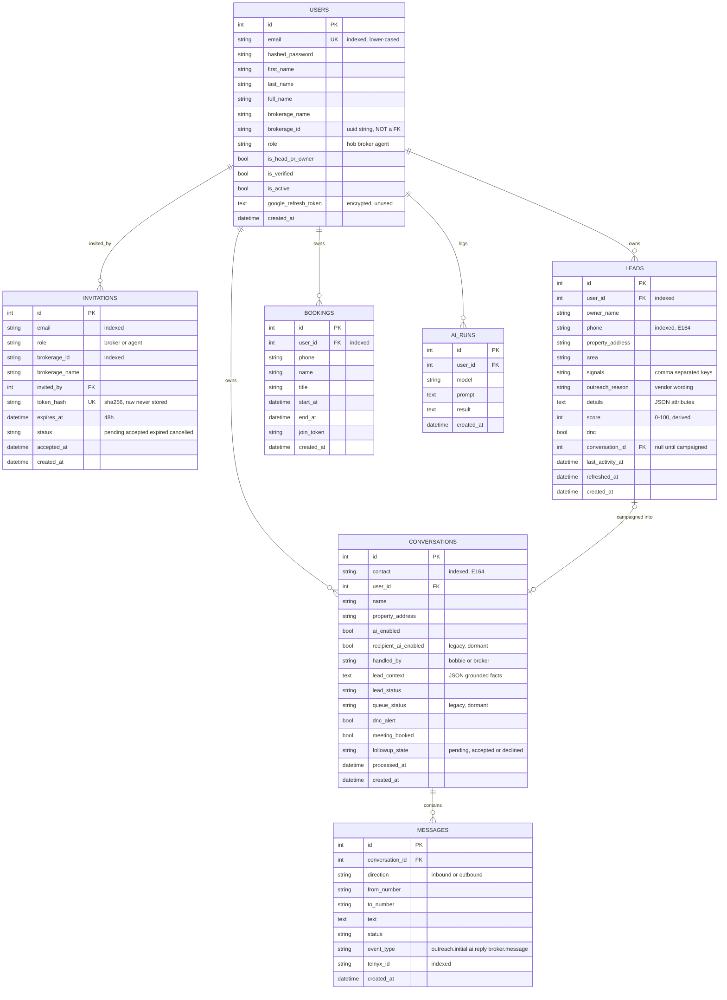

# ListingIQ — Current Database (as built)

Generated from the running system: **7 tables · 36 endpoints · migrations 0001–0007 · 218 tests passing.**

SQLite in development (`project/fastapi/listingiq.db`), PostgreSQL in production via `POSTGRES_URL`.

The diagram below renders on GitHub and in any Mermaid-aware viewer. The raw source is also
kept separately in [`erd-current.mmd`](erd-current.mmd) so it can be pasted into
[mermaid.live](https://mermaid.live) or exported to an image.

---

## The shape in one sentence

**Everything hangs off `users`.** There is no `brokerages` table — brokerage identity is a
uuid **string** column (`users.brokerage_id`), not a foreign key. Leads, conversations and
bookings are all scoped to a single broker, never to a brokerage.

That single fact is what the future modules have to change first: cross-brokerage lead
exclusivity and round-robin assignment both need an entity that does not exist yet.

---

## Entity relationship diagram



---

## Tables and who writes them

| Table | Written by | Read by | Migration |
|---|---|---|---|
| `users` | Registration; invitation acceptance | Every authenticated request | 0001 |
| `invitations` | HOB invite panel; acceptance | `/join` landing page | 0002 |
| `conversations` | Manual thread creation; campaign launch; every handover; the inbound classifier; Follow-ups decisions and manual status overrides | SMS tab; Follow-ups tab; lead pool sync | 0003, 0005, 0008 |
| `messages` | Every send; the Telnyx webhook | SMS thread; Follow-ups thread and its "has replied" filter; lead "last activity" | 0003 |
| `bookings` | Bobbie, when a meeting is agreed; the Follow-ups scheduler, when one is booked by hand | Availability calculation | 0004 |
| `leads` | CSV/XLSX import (batched inserts); campaign launcher | Lead Pool tab | 0006, 0007 |
| `ai_runs` | `ai_runtime.py` only — **nothing live calls it** | nothing | 0001 |

---

## Three columns worth understanding

**`conversations.handled_by`** — `bobbie` or `broker`. This is the handover gate. The AI
pipeline returns early unless it reads `bobbie`, so the rule "Bobbie never replies on a
broker-owned thread" is enforced in the database state, not in the UI. Sending a message
yourself, an owner opting out, a booking, or a closing message all move it to `broker`;
only an explicit hand-back moves it to `bobbie`.

**`conversations.followup_state`** — `pending`, `accepted` or `declined`. The Follow-ups
decision, kept apart from `handled_by` on purpose. Accepting a lead says who owns the outcome;
taking the thread off Bobbie is a different action with a different consequence, and folding
them together would silence her the moment anyone accepted a lead. Nothing in the AI pipeline
reads this column.

**`leads.stage`** — *does not exist*. Stage is derived on every read, in strict precedence:

```
dnc → in_campaign → needs_review (no phone) → new (refreshed < 24h) → ready
```

It is deliberately not a column so it can never drift from the conversation it describes —
delete a thread and the lead returns to `ready` automatically. **This conflicts with the
"stages changed manually, one stage prerequisite for another" requirement** in the
expectations sheet; see the gaps below.

---

## Structural gaps, read against the future modules

| # | Module | Gap |
|---|---|---|
| 1 | **Campaigns** | A campaign is a verb, not a row. No table joins a run of outreach to its leads, its message and its results, so "what went out, how many reached, how many replied" has nothing to query. Everything in campaign analytics depends on this table existing first. |
| 2 | **Data** | No record identity above the broker. No `brokerage_id` on `leads` or `conversations` at all. Two brokers importing the same list get two independent leads and both can text the same owner. "Used in one campaign, unavailable to any other" needs a global record keyed on phone/PIN plus a claim. |
| 3 | **Data** | Stage is derived, not stored (above). Manual stages with prerequisites need a stored column, an allowed-transition table, and an audit of who moved what. A hybrid is likely: system-owned for `in_campaign` and `dnc`, manual for the review stages. |
| 4 | **Assignments** | Nothing links an agent to a lead — no `assigned_to`, no assignment history, no round-robin cursor. Every query scopes by `user_id` = the logged-in broker. |
| 5 | **Data** | `GET /leads` returns the whole pool unpaginated and the UI polls it every 5s. It held at 4,485 leads; with batch ingestion it will not. Pagination is a prerequisite, not an optimisation. |
| 6 | **Inbound** | The Telnyx webhook matches a conversation on phone number alone, unscoped by owner. Today each broker works their own numbers so it holds; the moment two brokerages share a contact the newest thread silently wins. |
| 7 | **Cleanup** | Three routers are dead code — `/api/v1/conversations`, `/api/v1/messages`, `/api/v1/ai`. The frontend calls none of them and they duplicate live behaviour with weaker guards (`POST /messages/` bypasses the handover rule entirely). Delete before the schema grows around them. |
| 8 | **Cleanup** | `leads` and `conversations` both carry name, phone/contact, address and a DNC flag, synced one direction on every pool read. Once campaigns become a real entity this duplication needs resolving or the two will drift. |

---

## Files in this folder

| File | What it is |
|---|---|
| `ERD-current.md` | This document |
| `erd-current.mmd` | Mermaid ERD source, standalone |
| `tables.csv` | Column dictionary — every column, its type, key, default and **why it exists** |
| `endpoints.csv` | All 36 endpoints — tables read, tables written, the **actual query**, why it is shaped that way, and where the UI calls it |
