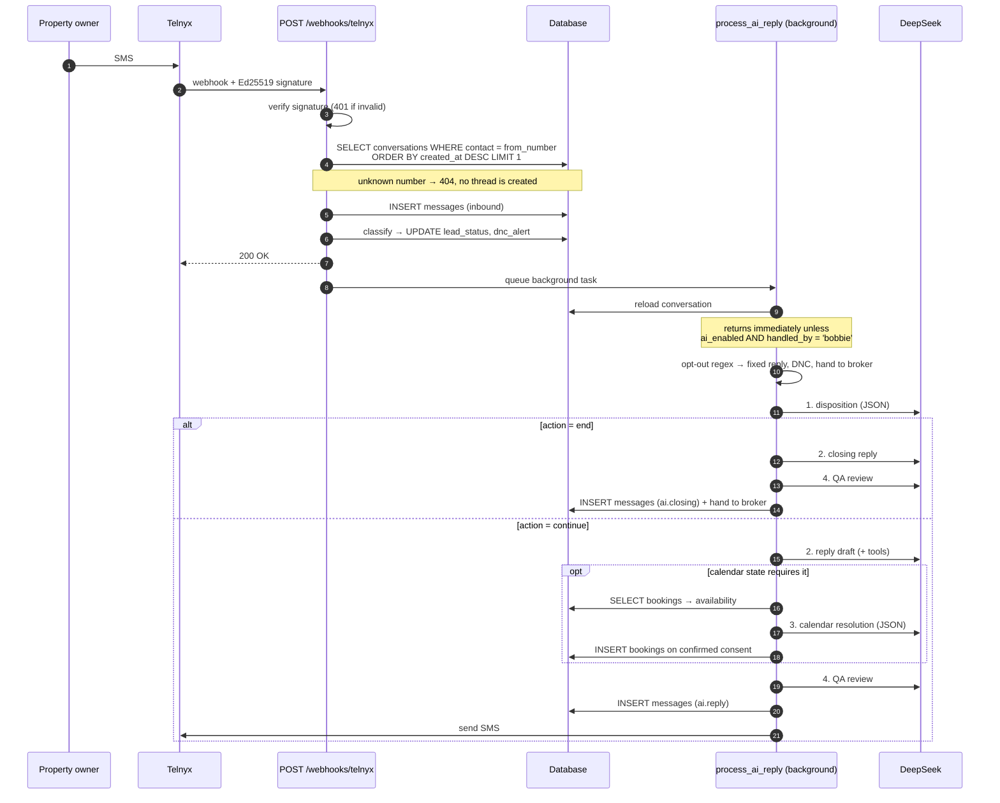
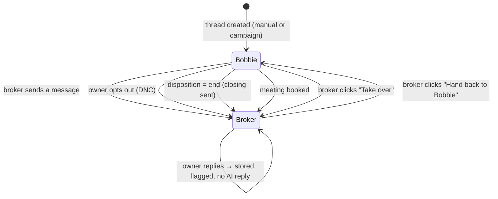

# SMS tab — conversation flow

How a thread starts, how a reply is produced, and who owns the next message at every point.

Code: `app/routes/sms.py`, `app/routes/webhooks.py`, `app/sms/service.py`.

---

## The one rule everything else serves

> **Bobbie is the default sender. When she stops, the thread becomes broker-owned, and any
> further owner reply is left pending for the broker — she never auto-answers it. An explicit
> hand-back is the only way she resumes.**

This is enforced by `conversations.handled_by`, checked at the top of the AI pipeline. It is
not UI logic: even a direct call to `process_ai_reply()` cannot produce a reply on a
broker-owned thread.

---

## Starting a thread

Two entry points, one outcome.

| Entry | Endpoint | Result |
|---|---|---|
| **New conversation** dialog | `POST /sms/conversations` | one conversation, one intro message |
| **Lead Pool** campaign | `POST /leads/campaign` | one conversation per selected lead, each with an intro, plus `leads.conversation_id` stamped |

Both create the row with `ai_enabled=true`, `handled_by='bobbie'`, `lead_status='processing'`,
and a `lead_context` JSON blob of the facts Bobbie is allowed to cite.

**The introduction is not written by a model.** `build_initial_outreach()` is string
interpolation:

```
Hey {first_name}, I'm reaching out about {property_address}. {outreach_reason}.
Would you be open to a brief conversation? Bobbie Fisher – RE/MAX
```

That is deliberate. The opener is the one message sent with no owner context to react to, and
the one most likely to create liability, so it is deterministic and reviewable rather than
generated. When a lead carries a vendor `outreach_reason`, that exact sentence is used.

**Reuse rule:** an existing conversation for the same number is reused if it has no messages;
if it already has history, the request is refused with 409 rather than sending a second
introduction.

---

## An owner replies



### Step detail

1. **Signature first.** `/webhooks/telnyx` is the only unauthenticated write path in the system.
   The Ed25519 signature is verified before the body is parsed. If `TELNYX_PUBLIC_KEY` is
   unset, requests are accepted with a loud warning — acceptable in development, not in
   production.

2. **Thread lookup is by phone number alone**, newest first.
   **Known gap:** not scoped by user or brokerage. Today each broker works their own numbers so
   it holds; the moment two brokerages share a contact the newest thread silently wins.

3. **Classification before AI.** `record_inbound_classification()` is regex, not a model. It
   sets `lead_status` and `dnc_alert` so the pool reflects the reply even if DeepSeek is down.

4. **Opt-out short-circuits everything.** "STOP", "remove me", "do not contact" are caught
   before any model call: a fixed sentence is sent, DNC is set, the thread is handed to the
   broker. No model is ever asked whether to honour an opt-out.

5. **The AI pipeline** — four layers, documented in
   [02-bobbie-ai-pipeline.md](02-bobbie-ai-pipeline.md).

---

## Who owns the next message



| Trigger | Endpoint / code | Result |
|---|---|---|
| Broker sends any message | `POST /sms/conversations/{id}/messages` | implicit handover → `broker` |
| Owner opts out | `process_ai_reply` opt-out branch | `broker` + `dnc_alert` |
| Conversation closes | disposition `action='end'` | `broker` after the closing SMS |
| Meeting booked | calendar branch | `broker` |
| Manual toggle | `POST /sms/conversations/{id}/handover?to=` | either direction |

**Sending is an implicit handover** because two voices in one thread is worse than one extra
click. The composer says so before you send.

**`awaiting_broker_reply`** is computed server-side as `handled_by='broker' AND the last message
is inbound`, and drives the amber "Needs your reply" banner and list badge.

---

## Sending outbound

`send_and_store_message()` (`app/sms/service.py`):

1. Resolve the sending number — `TELNYX_FROM_NUMBER`, else the fixed default
2. `POST https://api.telnyx.com/v2/messages`, or the in-process simulator when
   `SIMULATION_SMS_URL` is empty **and** `SMS_MODE=simulation`
3. `INSERT messages` with the carrier id in `telnyx_id` and an `event_type` recording provenance

| `event_type` | Written by |
|---|---|
| `outreach.initial` | the deterministic intro |
| `ai.reply` | Bobbie, continuing |
| `ai.closing` | Bobbie, ending the conversation |
| `calendar.confirmation` | a real booking Bobbie made, after the API succeeds |
| `broker.booking` | a real booking a person made from Follow-ups; the SMS names them, not Bobbie |
| `broker.message` | the broker's composer |
| `message.received` | the Telnyx webhook |

The UI reads `event_type` to label a bubble **Bobbie** or **You** without a second table.

---

## What the screen does

| Action | Endpoint | Notes |
|---|---|---|
| List threads | `GET /sms/conversations` | polled every 5s |
| Open thread | `GET /sms/conversations/{id}/messages` | polled every 5s |
| Send | `POST /sms/conversations/{id}/messages` | takes ownership |
| Take over / hand back | `POST /sms/conversations/{id}/handover?to=` | the only way Bobbie resumes |
| Delete thread | `DELETE /sms/conversations/{id}` | deletes messages first — no FK cascade |

Polling is a placeholder. At the current scale it is fine; it is on the list to replace with
push or a longer interval once the pool grows.

---

## Failure behaviour

Every layer degrades rather than guessing.

| Failure | Behaviour |
|---|---|
| No `DEEPSEEK_API_KEY` | No reply is sent. Autopilot stays on; the thread waits. |
| DeepSeek unreachable | Same — the inbound message is still stored and classified. |
| Draft violates policy | One repair attempt, then a hand-written safe fallback sentence. |
| Calendar unavailable | No times are offered. Bobbie never invents a slot. |
| Knowledge index down | The lookup returns `available: false` and she declines to state the fact. |
| Telnyx send fails | `SmsDeliveryError` → 502 to the broker, nothing recorded as sent. |

The consistent choice: **silence over a wrong message.**
