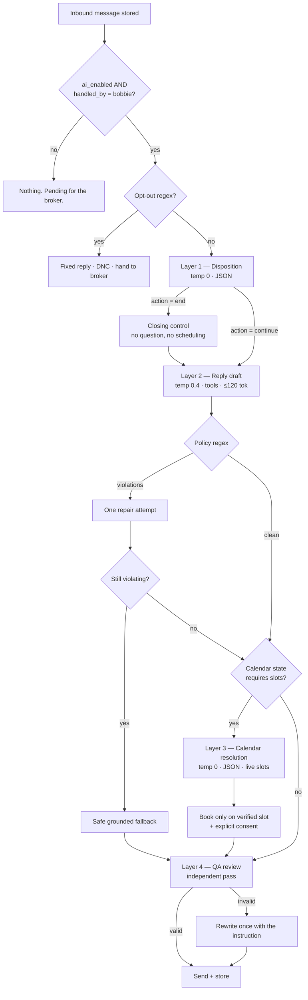

# Bobbie's AI pipeline

Four model layers and the deterministic guards around them.

Code: `app/sms/bobbie.py`, `app/sms/policy.py`, `app/sms/deepseek.py`, `app/sms/classifier.py`.
The prompts themselves are in [03-prompts.md](03-prompts.md); the regex guards are in
[04-policy-guards.md](04-policy-guards.md).

---

## Why four calls instead of one

One model call would be cheaper and materially worse. These are real SMS to real property
owners under TCPA and DNC rules, so the expensive failure is not a clumsy sentence — it is a
**confident false claim**: an invented buyer, a fee, a valuation, a booking that does not
exist.

The pipeline is built around four separations:

1. **Decisions are separated from wording.** A model asked to both decide and write will invent
   a justification for the sentence it wanted to write. Layer 1 returns JSON only.
2. **The wording layer is told mostly what it may not say.** It is a refusal specification more
   than a style guide.
3. **A second model checks the first.** Asking a model to review its own draft returns "looks
   good"; a fresh context catches the non sequitur and the invented booking.
4. **Regex has the final veto**, because regex cannot be talked out of it.

---

## The layers



---

## Layer 1 — Disposition

**Input:** the property address and the last 16 turns.
**Output:** JSON only — `action`, `intent`, `outcome`, `lead_status`, `confidence`,
`conversation_stage`, `next_step`, `qualification_focus`, `calendar{}`, `reason`.
**Settings:** `temperature=0`, `max_tokens=240`.

Everything it returns is validated against an allow-list before use. `action='end'` forces
`conversation_stage='complete'`, `next_step='close'` and `calendar.state='none'`, so a
malformed response cannot move the conversation into an invalid state.

**One server-side override:** when the model reports `conversation_stage='qualified_for_call'`
with no calendar state, `next_step` is forced to `offer_call`. This stops the interview
continuing past the point where the owner is ready — over-qualification was the most common
observed failure.

**Fallback:** `fallback_disposition()` runs the regex classifier — continue unless the message
is terminal, calendar inactive, and the reason records that the model was unavailable.

**Logged as** `[ai-disposition] contact=… action=… next_step=… calendar=… confidence=…`.

---

## Layer 2 — Reply draft

**Input:** the system prompt, the approved runtime context, the disposition control line, and
the last 30 messages.
**Output:** one SMS.
**Settings:** `temperature=0.4`, `max_tokens=120`, `tools=[get_lead_details,
search_bobbie_knowledge]`, `tool_choice='auto'`.

### Approved runtime context

The only facts she may state. Assembled by `_approved_runtime_context()`:

| Key | Contents |
|---|---|
| `lead` | the conversation's `lead_context` JSON — address, outreach reason, signals, imported property attributes |
| `lead.phone_number_source` | defaults to **unavailable** with an explicit instruction not to claim public/county/tax records |
| `lead.communication_capabilities` | `send_email: false`, `retrieve_live_comps: false`, `verify_recent_sales: false`, `perform_future_follow_up: false`, `send_sms_now: true` |
| `lead.verified_buyer` | defaults to **unavailable** with a safe response to use if asked |
| `bobbie_knowledge` | RAG hits from the profile PDF, only when the message needs them |

The defaults are the point: absence is expressed as an explicit "not available, say so plainly"
rather than as a missing key the model can fill in.

### Tool loop

At most three rounds. `search_bobbie_knowledge` is **pre-loaded** before the first call when
`needs_bobbie_knowledge()` matches the inbound text — any question mark, or terms about
experience, areas covered, fees, credentials — so the common case costs one round trip.

### Empty-draft retry

An empty completion triggers one retry at `temperature=0.1` with an explicit instruction, then
falls back to `safe_grounded_fallback()`.

---

## Layer 3 — Calendar resolution

Runs only when the disposition sets `should_fetch_availability`, which happens for
`call_accepted`, `time_proposed`, or `booking_confirmed`.

**Live slots are pasted into the prompt** as `start_at|end_at|label` lines. The model maps the
owner's words onto slots that already exist; the timestamps it returns are matched against the
real slot list before anything is booked.

**Most scheduling turns never reach the model.** `exact_offered_slot()` matches a bare owner
reply ("2pm works") against the slots Bobbie offered in the immediately preceding message,
using normalised weekday/month/day/hour parsing. A single unambiguous match books directly.

**Consent is required in the data**, not inferred:

| Consent value | Meaning |
|---|---|
| `offered_slot_selected` | owner picked one of the slots Bobbie just offered |
| `confirmed_exact` | Bobbie asked to book one verified slot and the owner agreed |
| `owner_proposed` | owner suggested a time Bobbie had not offered — must be verified and confirmed first |
| `none` | nothing is booked |

A booking is created only for `book` + one of the first two. On success the conversation is
marked `meeting_booked` and handed to the broker.

**`call_accepted` deliberately skips the model** — the server offers live slots directly via
`safe_available_offer()`, because there is nothing to resolve yet.

---

## Layer 4 — QA review

An independent pass over the finished draft with no stake in it. Returns
`{valid, issues[], rewrite_instruction, reason}`.

It checks the reply answers the latest message as a whole, follows the required next step,
makes sense after the immediately preceding turn, repeats no answered question, makes no
unsupported claim, and does not jump to scheduling unless the calendar state permits it.

Two rules it exists specifically to enforce:

- **When `next_step='offer_call'`, another qualification question without a call invitation is
  invalid.**
- **Any promise to book or confirm later is invalid.** A booking claim may only come from the
  calendar API after creation succeeds.

On `valid: false` the reply layer runs once more with the rewrite instruction appended.

---

## Model client

`app/sms/deepseek.py` — a single `completion()` function.

```python
{
  "model": AI_MODEL,           # default deepseek-v4-flash
  "messages": [...],
  "thinking": {"type": "disabled"},
  "stream": False,
  **options                    # temperature, max_tokens, tools, response_format
}
```

Timeout from `AI_REQUEST_TIMEOUT_MS` (default 30s). A missing key or any transport failure
raises `AiUnavailableError`, which every layer catches into its own fallback.

---

## Cost per inbound reply

| Layer | Calls | Max tokens out |
|---|---|---|
| Disposition | 1 | 240 |
| Reply | 1–3 (tool loop) | 120 |
| Repair | 0–1 | 80 |
| Calendar | 0–2 | 180 |
| QA review | 1 | 160 |
| Rewrite | 0–1 | 120 |

Typical: **3 calls.** Worst case with tools, a repair and a rewrite: **8.**

There is currently **no per-reply cost or latency record** — the intermediate reasoning only
reaches the application log, which rotates away. See the `ai_runs` note in
[`../ERD-current.md`](../ERD-current.md).
