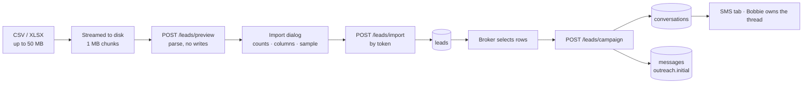

# Lead Pool — import to campaign

How a vendor file becomes a lead, and how a lead becomes a conversation.

Code: `app/leads/` (`importer.py`, `service.py`, `campaign.py`, `catalog.py`, `uploads.py`),
`app/routes/leads.py`.

---

## The whole path



---

## 1. Upload

Streamed to disk in 1 MB chunks with the **ceiling enforced while streaming**, so an oversized
file is refused after ~1 MB rather than being buffered whole. The partial file is deleted
before the error returns.

| Setting | Default | Env |
|---|---|---|
| Max size | 50 MB | `LEAD_UPLOAD_MAX_MB` |
| Staging directory | `data/uploads` | `LEAD_UPLOAD_DIR` |
| Time to live | 30 minutes | `LEAD_UPLOAD_TTL_MINUTES` |

Accepted: `.csv`, `.xlsx`. Not `.xls` — openpyxl reads the modern zip format only.

---

## 2. Preview — a dry run that writes nothing

`POST /leads/preview` parses the staged file and returns counts, the detected column mapping,
every column name, and the first 5 leads **as read**. It returns a **token**; the file waits on
disk so confirming does not re-upload a large spreadsheet.

The token is prefixed with the user id, checked against it, matched against
`\d+-[A-Za-z0-9_-]{10,64}`, and only ever used as a glob prefix inside the staging directory —
traversal is impossible, and another broker's token returns 410.

**Re-previewing with a different mapping** uses the same token, so correcting a column costs no
upload.

---

## 3. Column mapping

Vendor exports never agree on names, so each field has aliases, compared lower-cased with
separators stripped.

| Field | Recognised as |
|---|---|
| `owner_name` | owner, owner_name, name, full_name, contact_name, seller |
| `first_name` / `last_name` | first_name, last_name, surname — joined when there is no single name column |
| `phone` | phone, phone_number, mobile, cell, contact, telephone |
| `property_address` | property_address, address, property, street, site_address |
| `area` | area, city, neighborhood, market, town, submarket |
| `signals` | signals, tags, lead_type, category, motivation, **lead_source**, source, listing_status, status |
| `outreach_reason` | outreach_reason, reason, notes |
| `details` | lead_details, details, property_details, attributes |

**Signals also arrive as flag columns** — a column literally named `fsbo` or `tax_delinquent`
with `1`/`yes`/`x` counts as that signal.

**Every guess is overridable.** The import dialog shows a dropdown per field listing every
column in the file, plus "Not in this file". The mapping travels to both `/preview` and
`/import` as a JSON object.

> **Why this exists.** A lobbyist match file was imported whose `phone` column held the
> *agency's* number, not the owner's, and whose address lived in `search_address` — a name no
> alias would guess. 134,658 rows silently produced 1,453 leads. The mapping UI plus the sample
> table makes that visible before anything is written.

### Signal vocabulary

`fsbo`, `expired`, `pre_foreclosure`, `tax_delinquent`, `probate`, `divorce`, `vacant`,
`absentee_owner`, `high_equity` — each with aliases ("for sale by owner", "notice of default",
"nod", "inherited", "out of state owner", …).

**Two signals are derived from the details blob**, but only where the record states the fact
outright: `owner_occ: No` → **absentee_owner**, `listed_for_sale_by_owner: Yes` → **fsbo**.

---

## 4. Import

`POST /leads/import` with the token, an optional `limit`, and the mapping.

**One lead per readable row. Nothing is matched or merged** — not within the file, not against
the pool. Importing the same file twice adds every lead twice. That is a deliberate product
decision; the bulk-select and Remove in the pool is the cleanup path.

Rows are inserted with `bulk_save_objects` in **batches of 1,000**.

`limit=0` means all; otherwise rows are taken from the top of the file.

A row with neither a usable phone nor an address is skipped with a numbered warning
(`Row 8233: no usable phone or property address — skipped.`), surfaced in the dialog **before**
the import runs.

### Phone normalisation

Best-effort E.164. `+` prefix is kept; 10 digits become `+1XXXXXXXXXX`; 11 digits starting `1`
become `+1…`; anything else is rejected with a warning. Spreadsheet cells that arrive as floats
(`3125550142.0`) are converted to integers first, otherwise they would read as eleven digits.

---

## 5. Score and stage

**Score** — a transparent 0–100 sum, shown with its arithmetic in the details drawer:

| Component | Points |
|---|---|
| pre_foreclosure | 20 |
| expired | 18 |
| fsbo, tax_delinquent | 16 |
| probate, divorce | 14 |
| vacant, absentee_owner | 12 |
| high_equity | 10 |
| phone on file | 20 |
| address on file | 10 |

It orders a review queue. It predicts nothing, and the UI says so.

**Stage is derived on read**, never stored, in strict precedence:

```
dnc  →  in_campaign  →  needs_review (no phone)  →  new (refreshed < 24h)  →  ready
```

Deriving it means it cannot drift: delete a conversation and the lead returns to `ready`
automatically on the next read.

**`sync_activity()` runs before every list read** — it walks leads with a conversation, copies
the newest message timestamp into `last_activity_at`, propagates `dnc_alert` into `dnc`, and
clears `conversation_id` if the thread was deleted.

---

## 6. Campaign

`POST /leads/campaign` with the selected ids and an optional reason. **Capped at 200 leads.**

Per lead:

1. Refuse if blocked — DNC, no phone, no address, or already in a campaign
2. Reuse an untouched conversation for that number, else create one
3. Build `lead_context` from the lead: address, reason, signals, and the imported details blob
4. `ai_enabled=true`, `handled_by='bobbie'`
5. Send the deterministic introduction
6. Stamp `leads.conversation_id` and `last_activity_at`

**Outcomes are reported per lead, never as a failed batch** — forty selected leads should not be
lost to one bad phone number. Skips come back with a reason: *"On the do-not-contact list."*,
*"No usable phone number."*, *"Already in a campaign."*

### The outreach reason

In precedence:

1. the reason the broker typed in the campaign dialog, if any
2. **the lead's own `outreach_reason`** from the import — the vendor's wording
3. a per-signal sentence: *"Public records show a pre-foreclosure filing on the property"*
4. fallback: *"I came across the property while reviewing records in the area"*

Blank is usually best for a mixed selection — an expired listing and a probate lead need
different opening lines, and each lead supplies its own.

---

## Known limits

| Limit | Detail |
|---|---|
| **No pagination** | `GET /leads` returns the entire pool. Held at 4,485 leads; will not hold under batch ingestion. |
| **No deduplication** | By design, as of the current build. Re-importing duplicates everything. |
| **Per-broker only** | `leads.user_id` — no brokerage-level pool, no cross-brokerage exclusivity. |
| **No campaign record** | The batch is not stored, so campaign analytics has nothing to query. |
| **50 MB ≈ 600k rows in memory** | The parse holds all rows at once. Comfortable at 120k; batching the parse is the next step if you go higher. |
