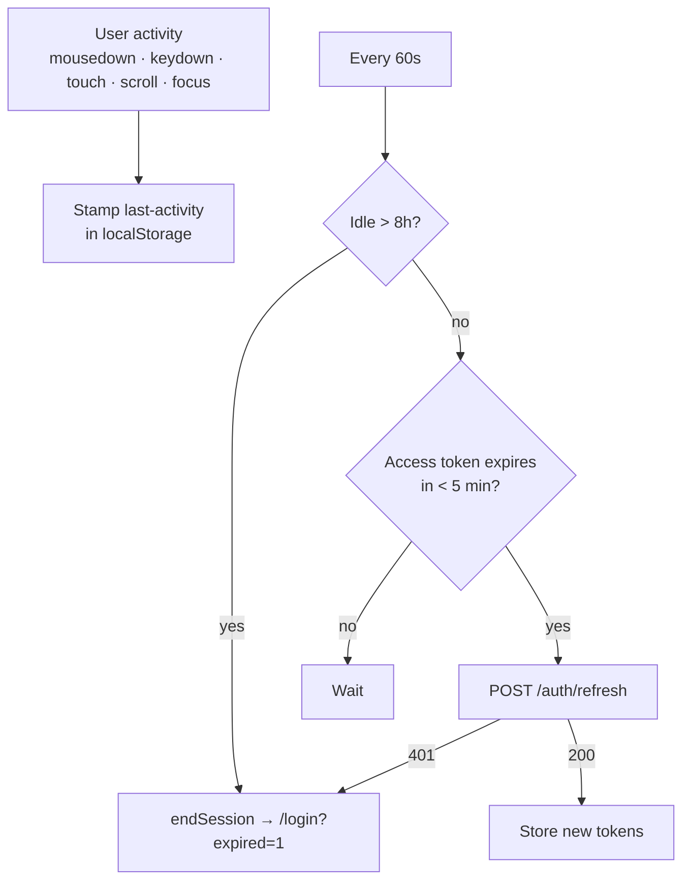
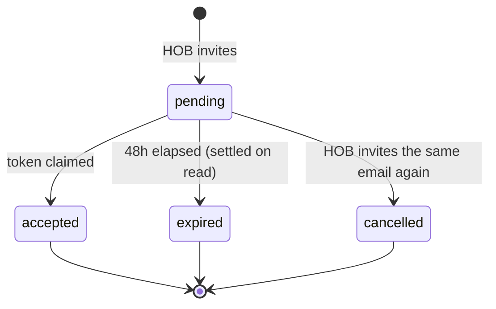

# Auth, sessions and invitations

Code: `app/routes/auth.py`, `app/routes/team.py`, `app/auth.py`,
`src/features/auth/lib/session-guard.ts`.

---

## Tokens

| | Access token | Refresh token |
|---|---|---|
| Lifetime | 60 minutes (`ACCESS_TOKEN_EXPIRE_MINUTES`) | 30 days |
| Contents | `user_id`, `role`, `sub`, `exp` | same |
| Storage | browser `localStorage` | browser `localStorage` |
| Sent as | `Authorization: Bearer …` | request body to `/auth/refresh` |

Signed with `SECRET_KEY` (HS256, PyJWT). Passwords are `pbkdf2_sha256` via passlib.

**No server-side sessions.** There is no session table and no revocation list — a token is
valid until it expires. Deactivation takes effect at the next login or refresh, because
`is_active` is re-checked on both.

**`HTTPBearer(auto_error=False)`**, not `OAuth2PasswordBearer`. The OAuth2 scheme made Swagger
demand a form-encoded `username`/`password` body and return 422 on the JSON the app actually
sends. Bearer is what the API really uses.

---

## The 8-hour idle session

Access tokens live 60 minutes, so an 8-hour working session is impossible without refresh.
`session-guard.ts` provides it:



Any API call returning **401** also ends the session immediately, so a revoked or expired token
cannot leave the UI polling forever.

---

## Registration

`POST /auth/register`

1. `SELECT users WHERE email = ?` — reject duplicates before hashing, so response time does not
   reveal whether an account exists
2. Hash the password
3. First user of a brokerage: `role='hob'`, `is_head_or_owner=true`, and a **new
   `brokerage_id` uuid string**
4. Return tokens plus the user

---

## Invitation lifecycle



### Issuing — `POST /team/invitations`

| Rule | Why |
|---|---|
| HOB only | Enforced from `current_user.role`, never from the request |
| `brokerage_id` from the inviter | Never accepted from the client |
| Domain must match the **inviter's own email domain** | Derived server-side; there is no brokerage record to look it up in |
| Role validated server-side | The client cannot invite an `hob` |
| Prior pending invites → `cancelled` | Only one token is ever live per email |
| 60-second cooldown → **429** | Blocks resend spam |
| Email failure → rollback + **502** | No orphan invitation row for an email that never sent |

**Only the SHA-256 hash of the token is stored.** The raw token exists solely in the emailed
link, so a database leak cannot be replayed into an account.

The response never reveals whether an unrelated user already exists.

### Accepting — `POST /team/invitations/{token}/accept`

The claim is atomic:

```sql
UPDATE invitations SET status='accepted', accepted_at=?
 WHERE id = ? AND status = 'pending'
```

If the row count is not exactly 1, the request is rejected. Two simultaneous accepts cannot both
create an account. The new user inherits `brokerage_id` and `role` **from the invitation**, not
from the form.

---

## Email delivery

Python `smtplib` with `MIMEMultipart` (`app/routes/team.py`). Configured entirely through
`SMTP_HOST` / `SMTP_PORT` / `SMTP_USER` / `SMTP_PASSWORD` / `SMTP_FROM`, so switching to Amazon
SES is a credential change, not a code change.

**No Node.js mailer anywhere in the stack**, by requirement.

**Currently unconfigured** — invitations cannot actually be delivered until SMTP credentials are
set.

---

## Roles

| Role | Can |
|---|---|
| `hob` | everything, plus invite members and rebuild the knowledge index |
| `broker` | lead pool, SMS workspace, calendar |
| `agent` | lead pool, SMS workspace, calendar (no assignment concept exists yet) |

`LEAD_ROLES` and `SMS_ROLES` are both `{hob, broker, agent}`. Access is per-user: every query
filters on `user_id`, so a broker sees only their own leads and threads. **There is no
brokerage-level visibility** — an HOB cannot currently see their team's pipeline.

---

## Outstanding before production

- **SMTP credentials** — invitations do not send
- **`SECRET_KEY`** — must be a strong production value; changing it invalidates all tokens
- **`TELNYX_PUBLIC_KEY`** — unset means webhooks are accepted unverified, with a warning
- **Key rotation** — API keys pasted into chat during development should be rotated
