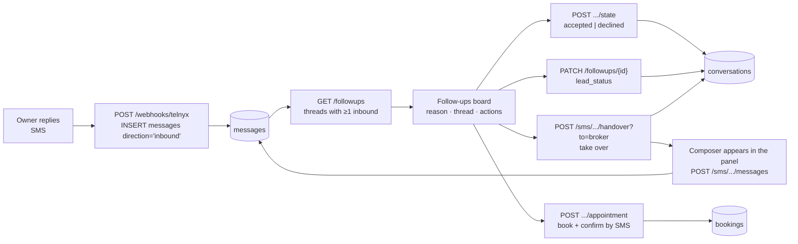

# Follow-ups — the replied leads and what happens to them

The SMS tab is the chat module: every thread, answered or not. Follow-ups is the working queue
built on top of it — **only conversations the owner has actually replied to** — and the four
decisions someone can record on one.

Code: `app/routes/followups.py`, `features/followups/` (board, appointment dialog, api).

---

## The whole path



---

## 1. Who is on the list

One rule: **at least one inbound message on the thread.** A lead who was texted and never
answered stays in the SMS tab, where the unanswered outreach belongs. The filter is a single
`SELECT DISTINCT messages.conversation_id … WHERE direction = 'inbound'` joined to the caller's
own conversations, so nothing about "has replied" is stored — it cannot drift.

Ordering is the most recent reply first. Rows are then filterable by the recorded decision
(`?state=pending|accepted|declined`).

The list loads every message and lead row for the whole page in **one query each**, grouped in
Python. This is the one place that deliberately does not follow `routes/sms.py`, which queries
per conversation.

---

## 2. The waiting reason — derived, never stored

The first line of every card. Computed on read, in strict precedence:

```
opted out → reply needs an answer → appointment booked → appointment to confirm
          → not interested → no response for N days (N ≥ 2) → conversation in progress
```

That order is the triage. An opt-out is a compliance stop, an unanswered reply is owed today, a
booking is either settled or still to arrange, and only then does silence matter. Changing the
order changes what the assignee does first, so it lives in one function — `_reason()`.

---

## 3. The four decisions

| Action | Endpoint | Writes | Why it is separate |
|---|---|---|---|
| Accept / Decline | `POST /followups/{id}/state` | `followup_state` | Records who owns the **outcome**. It does not touch `handled_by`, so accepting a lead never silences Bobbie by accident. Reversible. |
| Status override | `PATCH /followups/{id}` | `lead_status` (+ `dnc_alert`, `ai_enabled`, `handled_by` for `dnc`) | The one path that **does not merge** with the classifier: the person reading the thread outranks it in either direction, downgrades included. `dnc` also stops autopilot, because an owner who opted out must never be texted again. |
| Take over and reply | `POST /sms/conversations/{id}/handover?to=broker`, then `POST /sms/conversations/{id}/messages` | `handled_by`, `ai_enabled`, `messages` | Both are the existing SMS endpoints — Follow-ups adds no second way to hand over or to send. Taking over reveals a composer in the panel and focuses it, so a reply never costs a trip to the SMS tab. The composer is gated on `handled_by = 'broker'` for the same reason sending is an implicit handover: two voices on one thread is worse than an extra click. See [01-sms-conversation-flow.md](01-sms-conversation-flow.md). |
| Schedule | `POST /followups/{id}/appointment` | `bookings`, `meeting_booked`, `messages` | Below. |

Reading a thread reuses `GET /sms/conversations/{id}/messages` for the same reason.

---

## 4. Booking by hand

Slots come from `GET /sms/calendar/availability` — **the same availability Bobbie offers**, so a
manual booking and one she is negotiating cannot collide. The overlap check then runs inside the
transaction that inserts the row; a collision is a `409`, not a double-booked broker.

The confirmation SMS is sent with `suppress_auto_reply=True` so Bobbie does not answer her own
message. Because the booking is already committed by then, a delivery failure returns
`notified: false` with a `note` **alongside the confirmed meeting** rather than failing the
request — the meeting is real even when the text is not.

Refused outright (`409`) for an owner who has opted out.

---

## 5. Ownership

Every endpoint resolves the conversation as `WHERE id = ? AND user_id = <JWT user>`, so another
brokerage gets a `404` — the same shape as the SMS workspace, and it never confirms that an id
exists. Roles: `hob`, `broker`, `agent`.
