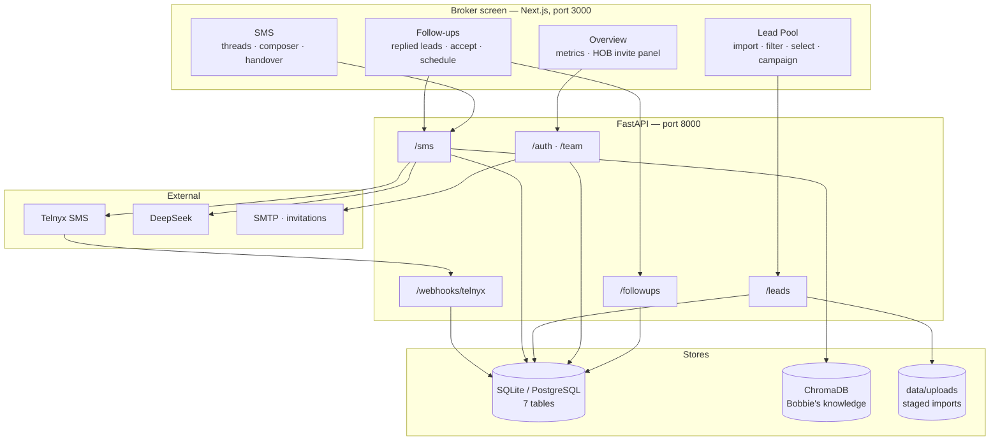

# Flow documentation

How the system actually behaves, written from the running code. Companion to the schema
reference in [`../ERD-current.md`](../ERD-current.md), [`../tables.csv`](../tables.csv) and
[`../endpoints.csv`](../endpoints.csv).

| Document | Covers |
|---|---|
| [01-sms-conversation-flow.md](01-sms-conversation-flow.md) | How a thread starts, the inbound webhook path, the handover state machine, outbound sending, failure behaviour |
| [02-bobbie-ai-pipeline.md](02-bobbie-ai-pipeline.md) | The four model layers, why there are four, validation, fallbacks, cost per reply |
| [03-prompts.md](03-prompts.md) | Every prompt verbatim, with the reasoning behind each — **generated from source** |
| [04-policy-guards.md](04-policy-guards.md) | The deterministic layer: opt-out, classifier, violation scan, safe fallbacks |
| [05-lead-pool-flow.md](05-lead-pool-flow.md) | Upload → preview → column mapping → import → campaign |
| [07-followups-flow.md](07-followups-flow.md) | Who reaches the Follow-ups list, the waiting reason, and the four decisions on a replied lead |
| [06-auth-invitation-flow.md](06-auth-invitation-flow.md) | Tokens, the 8-hour idle session, invitation lifecycle, roles |

---

## The system in one picture

**Two ports only** — 3000 and 8000. The SMS simulator, the meeting calendar and the RAG index
all run in-process rather than as separate services.

---

## The three rules that shape everything

**1. Bobbie is the default sender, and stopping is one-way.**
`conversations.handled_by` gates the AI pipeline. Once a thread is broker-owned, every further
owner reply is stored and flagged, never auto-answered. Only an explicit hand-back resumes her.

**2. She may only state approved facts.**
The reply prompt is largely a refusal list; the approved runtime context expresses absence
explicitly ("not available, say so plainly") rather than leaving a gap to fill; and ~20 regexes
hold the final veto over anything generated. When the model is unavailable, **nothing is sent**.

**3. Derived beats stored.**
Lead stage, `awaiting_broker_reply` and the score are all computed on read from the state that
already exists. They cannot drift from the conversations they describe.

---

## Reading order

New to the codebase: **README → 01 → 02 → 04.**
Working on imports or campaigns: **05.**
Working on the assignee's queue: **07.**
Changing Bobbie's behaviour: **03 and 04 together** — the prompt is a request, the regexes are
the enforcement.

---

## Keeping this accurate

`03-prompts.md` is generated by extracting the prompt strings from `app/sms/bobbie.py` and
rendering `build_bobbie_prompt()`, so it cannot silently drift. If you edit a prompt,
regenerate it. The other documents are hand-written and were verified against the code on
writing — treat the code as the source of truth where they disagree, and correct the document.
