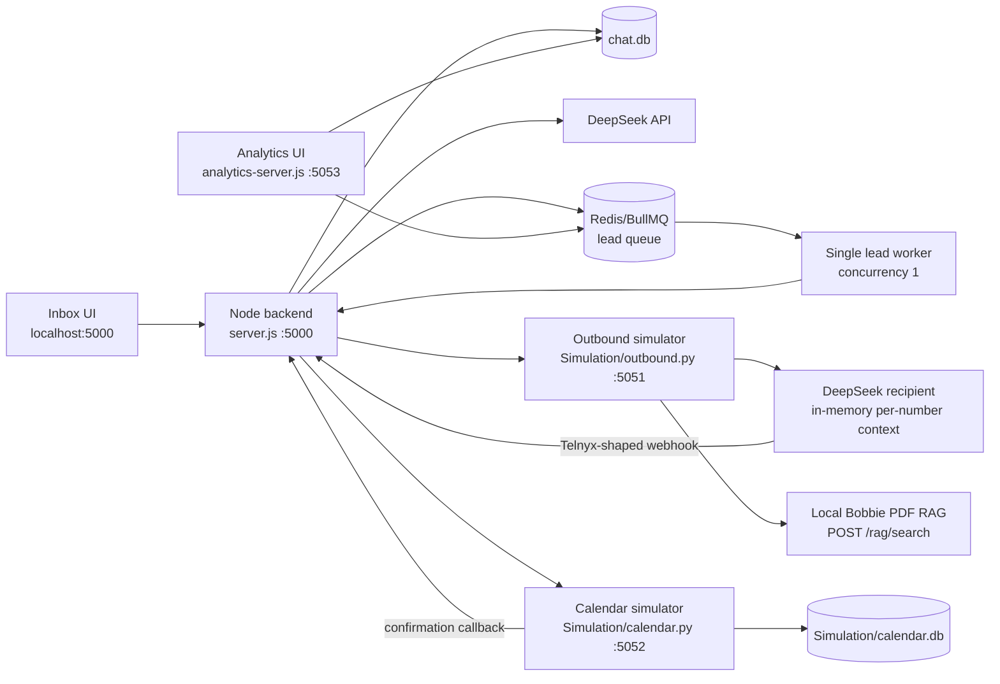

# ListingIQ SMS Bobbie Lab

This repository is a local proving ground for the ListingIQ SMS conversation system. Its purpose is to mature Bobbie's behavior, validate scheduling and analytics, and test complete conversations without paying Telnyx delivery charges or contacting real property owners.

It is not the final production application. Once the behavior and contracts are stable, the intended destination is:

```text
/home/user/Linchpin/AI_SELLER_INTELLIGENCE_PLATFORM
```

The expected production implementation is a Next.js frontend with a FastAPI backend, PostgreSQL persistence, Redis/Celery background work, verified Telnyx webhooks, and a real calendar or meeting provider.

## What this project is proving

The lab currently tests these product rules:

- Bobbie and the simulated recipient retain separate context per phone number.
- Bobbie qualifies naturally without repeatedly asking answered questions.
- Bobbie answers the owner's concern before asking the next question.
- Bobbie offers a short call once there is enough selling interest and one useful detail such as motivation, price, timing, or selling conditions.
- In this project, **call**, **meeting**, and **appointment** mean the same scheduled event. A text **chat** or **conversation** is not automatically a meeting.
- Calendar availability is fetched only after the owner accepts a call/meeting.
- Selecting one of Bobbie's offered live slots is sufficient booking consent.
- A booking is never claimed until the calendar API successfully creates it.
- Overlapping bookings are rejected transactionally.
- A successful booking sends a confirmation message with the time and a dummy join link.
- Strong lead intent is preserved in analytics even when the conversation ends with a polite goodbye.
- DNC, direct rejection, wrong number, and no-response outcomes stop automation appropriately.
- Bulk simulation processes one queued lead at a time so conversation, calendar, and analytics state do not mix.

The simulation avoids Telnyx message charges, but DeepSeek API calls can still incur provider usage or limits.

## Current architecture



### Service and port map

| Port | Process | Responsibility |
|---|---|---|
| `5000` | `node server.js` | Inbox frontend, conversation API, webhook receiver, Bobbie orchestration, message persistence, SSE events |
| `5051` | `python3 Simulation/outbound.py` | Telnyx-compatible outbound simulation, automatic recipient simulation, local Bobbie knowledge search |
| `5052` | `python3 Simulation/calendar.py` | Availability, collision-safe bookings, calendar UI, dummy meeting links and confirmation callback |
| `5053` | `npm run analytics` | Read-only lead analytics dashboard |
| `6379` | Redis | BullMQ lead jobs and queue state; not the authoritative conversation store |

Only port `5000` needs to be exposed when sharing the inbox through ngrok. The Node process can continue calling ports `5051` and `5052` locally, and analytics can remain local. The default dummy join link uses `127.0.0.1:5052`, so it will not be usable by a remote tester unless the calendar is separately exposed and started with an appropriate `--public-base-url`.

## Testing now versus production later

| Concern | Current testing implementation | Expected production implementation |
|---|---|---|
| Frontend | Static `index.html`, `client.js`, and `styles.css` | Authenticated Next.js application using typed API clients and reusable inbox/dashboard components |
| Backend | One Node HTTP server with route conditionals | FastAPI routers, Pydantic contracts, dependency injection, service/repository layers |
| Primary database | Local SQLite `chat.db` | PostgreSQL as the authoritative multi-user store |
| Calendar database | Separate SQLite `Simulation/calendar.db` | PostgreSQL booking tables plus a real calendar/meeting provider |
| Background jobs | BullMQ and Redis, concurrency `1` | Celery and Redis, initially one Bobbie lead task at a time, with explicit per-conversation locking and idempotency |
| SMS delivery | Local Telnyx-shaped simulator; no real recipient | Telnyx messaging API with verified inbound/status webhooks |
| Recipient | DeepSeek simulation or a human typing from the UI | A real property owner; recipient AI remains a QA-only facility |
| Bobbie AI | DeepSeek through an OpenAI-compatible adapter | Provider-neutral AI service with versioned prompts, structured responses, audit records, retries, budgets and evals |
| Bobbie knowledge | Lexical retrieval from a local PDF | Approved knowledge corpus in a managed retrieval layer or PostgreSQL/pgvector with source/version metadata |
| Meetings | Fixed local weekday availability and a dummy join URL | Real agent availability, timezone-aware booking, provider event ID, real join/call details, reschedule/cancel/reminders |
| Analytics | Polling dashboard over `chat.db` and Redis counts | Authorized Next.js dashboard backed by FastAPI/PostgreSQL aggregates and event/audit data |
| Realtime updates | Server-Sent Events from the Node process | Authenticated SSE or WebSocket channel scoped to user, team and tenant |
| Security | Local trusted environment | Authentication, authorization, tenant isolation, secrets manager, encryption, rate limits and audit logs |
| Compliance | Test data and dummy numbers | Consent checks, campaign approval, sender registration, webhook verification, retention policy and legal review |

Simulation-only payload fields such as `simulation_recipient_enabled`, `simulation_lead_context`, and `suppress_auto_reply` are removed before a real Telnyx request. Bulk lead outreach is intentionally blocked when `SMS_MODE=telnyx`.

## Runtime flow

### Single conversation

1. The frontend sends name, E.164 phone number, property address, outreach reason, and AI toggle values to `POST /outreach`.
2. `server.js` creates the conversation and stores its approved lead context in `chat.db`.
3. In simulation mode, the outbound message goes to `POST http://127.0.0.1:5051/v2/messages` rather than Telnyx.
4. If Recipient AI is enabled, `Simulation/outbound.py` asks DeepSeek to respond as that property owner.
5. The simulated recipient posts a Telnyx-shaped `message.received` event to `POST /webhooks`.
6. Node stores the inbound message before running Bobbie.
7. Bobbie's disposition layer returns structured JSON describing continuation/end state, lead outcome, qualification stage, next step and calendar state.
8. The response generator receives stored history, lead context, relevant Bobbie knowledge, and the required next step.
9. Policy checks block unsupported facts, identity changes, repeated questions, fake availability and unbooked confirmations.
10. An independent DeepSeek reviewer checks whether the draft is the response the owner would reasonably expect.
11. The approved reply is stored in `chat.db` and sent through the configured SMS adapter.

### Meeting/call booking

1. Bobbie asks for a short call/meeting only after sufficient qualification.
2. The owner accepts the meeting.
3. Node fetches `GET /api/availability` from the calendar service.
4. Bobbie offers verified slots, normally from different days.
5. The owner selects a slot. Selecting an offered slot is confirmation; another `yes` is not required.
6. The selected text is matched against the immediately preceding offered slots and current availability. Complex natural-language selections use the DeepSeek calendar resolver with structured JSON and retry protection.
7. Node posts the exact UTC start/end to `POST /api/bookings`.
8. `calendar.py` uses a SQLite `BEGIN IMMEDIATE` transaction and overlap query before inserting the booking.
9. The calendar posts the completed confirmation text to Node's simulation-only `POST /calendar-confirmation` endpoint.
10. Node stores the confirmation, disables Bobbie autopilot for that completed lead, and marks `ready_to_sell` plus `meeting_booked=true`.

If calendar interpretation fails, the system must not claim the time is unavailable. If a slot is taken between availability lookup and insertion, the calendar returns HTTP `409` and Node offers newly fetched alternatives.

### Bulk simulation

1. The frontend parses an imported CSV and posts normalized rows to `POST /bulk-outreach`.
2. Node stores each conversation and lead context in `chat.db`.
3. One BullMQ job is created per phone number.
4. `lead-queue.js` runs one job at a time with `concurrency: 1`.
5. A job remains active until that conversation completes, Bobbie is disabled, or an optional timeout is reached.
6. The worker waits five seconds by default before moving to the next lead.

Bulk jobs are serialized. Automatic recipient DeepSeek calls are also limited to one at a time by default. Manual inbound activity on several conversations is not globally serialized by BullMQ; production must add explicit per-conversation locks and decide whether Bobbie also needs a tenant-wide/global concurrency limit.

## Database and state ownership

### `chat.db` — active conversation database

Owner: [`db.js`](./db.js)

Used by:

- `server.js` for conversation and message reads/writes.
- `analytics-server.js` for lead categories and totals.
- `scripts/reset-simulation.js` when clearing the lab.

Main tables:

- `conversations`: phone number, real display name, property address, Bobbie toggle, recipient toggle, approved lead JSON, queue status, lead status, DNC flag, meeting-booked flag and processed time.
- `messages`: conversation ID, direction, from/to numbers, body, delivery status, event type, provider/simulator ID and timestamp.

The phone number is the current conversation key. Bobbie reconstructs context from stored message history because DeepSeek requests are stateless.

### `Simulation/calendar.db` — active simulation booking database

Owner: [`Simulation/calendar.py`](./Simulation/calendar.py)

Main table:

- `bookings`: phone, name, title, UTC start/end, unique join token and creation time.

Node does not directly write this database during normal operation. It uses the calendar HTTP API, keeping overlap checks and booking creation owned by the calendar service. The reset script opens it only to delete test bookings.

### Redis — queue state, not business truth

Owner: [`lead-queue.js`](./lead-queue.js)

Queue name: `lead-conversations`

Redis contains waiting/active/failed job state and the job payload needed to start a bulk conversation. Completed jobs are removed. Conversation history, analytics categories and bookings must never be reconstructed from Redis.

### `sms.db` — not active

The root `sms.db` file has no references in the active runtime code. It is a legacy artifact and is not authoritative. Do not migrate its contents into the production schema without separately establishing why the data is needed.

### In-memory state

- Node keeps SSE browser connections and per-contact reply debounce timers in memory.
- The outbound recipient simulator keeps recipient conversation history and active-contact locks in memory.
- Recipient simulator memory is lost when `Simulation/outbound.py` restarts.
- Bobbie history is persistent because it is always rebuilt from `chat.db`.

Production should move required durable state to PostgreSQL and use Redis only for locks, ephemeral coordination, caching and queues.

## Backend responsibilities

### `server.js`

The current orchestration boundary. It serves the UI, receives webhooks, validates input, switches between simulation and Telnyx, stores messages, triggers Bobbie, calls the calendar, emits SSE events, and starts the BullMQ worker.

### Bobbie runtime

- `ai-runtime.js`: DeepSeek adapter, structured disposition, reply generation, tool calls, semantic reviewer and calendar resolution.
- `bobbie-prompt.js`: active compact Bobbie system prompt and scheduling guidance.
- `bobbie-policy.js`: deterministic output safety, anti-fabrication and repetition checks, plus grounded fallbacks.
- `bobbie-knowledge.js`: client for the local Bobbie knowledge endpoint.
- `lead-classifier.js`: deterministic immediate lead signals, DNC/no-response handling and strongest-status merging.
- `scheduling-state.js`: output guards for scheduling pressure, invented time proposals and unbooked confirmations.
- `outreach.js`: safe lead context and initial single-conversation message construction.
- `lead-queue.js`: BullMQ queue and single-concurrency worker configuration.

Bobbie's active logic is intentionally layered:

```text
stored inbound message
  -> deterministic DNC/lead signal
  -> DeepSeek disposition JSON
  -> optional calendar availability/resolution
  -> DeepSeek Bobbie draft with approved tools/context
  -> deterministic policy checks and repair
  -> independent semantic review and repair
  -> send and store
```

### Simulation services

- `Simulation/outbound.py`: fake Telnyx outbound endpoint, automatic DeepSeek recipient, per-number in-memory recipient history, and local PDF retrieval endpoint.
- `Simulation/inbound.py`: command-line sender for a Telnyx-shaped inbound webhook; useful instead of Postman.
- `Simulation/calendar.py`: local calendar UI/API, availability generation, collision protection and confirmation callback.
- `Simulation/build_property_leads.py`: builds selected dummy-number CSVs from the source ZIP.
- `Simulation/test_outbound.py`: Python tests for the simulation adapter.

## Frontend responsibilities

- `index.html`: inbox layout, conversation list, new-conversation form, Bobbie/Recipient controls, bulk import and confirmation dialogs.
- `client.js`: API calls, SSE refresh, message rendering, composer sender behavior, CSV normalization and UI state.
- `styles.css`: responsive inbox, fixed/scrollable message and conversation panels, desktop/mobile behavior.
- `analytics/index.html`, `analytics/app.js`, `analytics/styles.css`: separate polling analytics dashboard.

The two AI toggles are independent per conversation:

| Bobbie | Recipient | Result |
|---|---|---|
| On | On | Fully automatic two-agent simulation |
| On | Off | Human writes as recipient; Bobbie replies automatically |
| Off | On | Human writes as Bobbie; recipient replies automatically |
| Off | Off | Fully manual; operator selects which side to send as |

Manual recipient input uses `POST /simulate-inbound` and is rejected outside simulation mode.

## Important data folders

- `data/source/`: original inputs. The ZIP is source material; `52_common_sms_conversation_cases.csv` is currently a behavioral reference, not a per-contact coaching selector.
- `data/generated/`: generated lead CSVs with dummy phone numbers for controlled tests. `expired_listing_leads_10.csv` is useful for a small focused run; `property_leads_50.csv` covers multiple source types.
- `data/knowledge/`: Bobbie documents. The active local RAG source is `Bobbie_Fisher_REMAX_Comprehensive_Profile_and_AI_Knowledge_Base.pdf`. Other DOCX/PDF/parquet files are reference or experimental unless active code is changed to load them.
- `data/examples/chat Morgan Close`: example conversation reference. It is not injected as property truth into unrelated live prompts.
- `archive/`: retired implementations retained only for reference. Nothing here should be imported by production code.
- `test/`: Node regression tests for AI orchestration, policy, classification, scheduling and frontend contracts.

## HTTP API inventory

### Node service (`:5000`)

| Method and route | Purpose | Production status |
|---|---|---|
| `GET /` | Serve the current inbox | Replace with Next.js |
| `GET /conversations` | List conversations | Migrate to authenticated FastAPI route |
| `GET /conversations/:contact` | Message history | Migrate; use stable conversation IDs rather than phone in path |
| `POST /conversations` | Update contact/settings | Migrate with authorization and audit trail |
| `POST /outreach` | Create one lead and initial outreach | Preserve as an application command |
| `POST /send` | Send as Bobbie | Preserve behind authorization and compliance checks |
| `POST /simulate-inbound` | Human test input as recipient | Development/test only |
| `POST /bulk-outreach` | Queue simulation leads | Replace with authenticated upload/import job |
| `POST /bulk` | Low-level multi-message send | Experimental; do not expose directly in production |
| `POST /webhooks` | Telnyx-shaped inbound/status webhook | Preserve with signature verification and idempotency |
| `POST /calendar-confirmation` | Simulation calendar callback | Replace with internal authenticated event/command |
| `GET /events` | SSE UI updates | Replace or secure for production |
| `DELETE /messages/:id` | Permanently delete one message | Add policy, authorization and audit requirements |
| `DELETE /conversations/:contact` | Permanently delete conversation/messages | Add policy, authorization and audit requirements |

### Outbound/RAG simulator (`:5051`)

- `POST /v2/messages`: accepts Telnyx-like outbound requests and returns a zero-cost simulated queued response.
- `POST /rag/search`: searches the approved local Bobbie PDF.

### Calendar simulator (`:5052`)

- `GET /api/availability`: next 14 days of unbooked weekday slots, 9 AM–6 PM, 30 minutes, in the configured timezone.
- `GET /api/bookings`: list simulated bookings.
- `POST /api/bookings`: create a non-overlapping booking and send its confirmation callback.
- `GET /join/:token`: dummy meeting-room page.

### Analytics (`:5053`)

- `GET /api/dashboard`: conversation totals/categories from `chat.db` plus current Redis queue counts.

## Local setup

### Requirements

- Node.js 20 or newer.
- Python 3 with timezone data.
- Redis reachable at `REDIS_URL` or `redis://127.0.0.1:6379`.
- `pdftotext` for lazy local PDF indexing.
- `openpyxl` only when rebuilding generated lead CSVs.
- A DeepSeek/API key for Bobbie and automatic recipient turns.

Install Node dependencies:

```bash
npm install
```

### Start a full simulation

Use separate terminals:

```bash
docker start sms-simulation-redis
```

```bash
python3 Simulation/outbound.py --max-parallel 1
```

```bash
python3 Simulation/calendar.py --timezone America/Chicago
```

```bash
node server.js
```

```bash
npm run analytics
```

Open:

- Inbox: `http://127.0.0.1:5000`
- Calendar: `http://127.0.0.1:5052`
- Analytics: `http://127.0.0.1:5053`

Run automatic recipient replies without a cap:

```bash
python3 Simulation/outbound.py --max-auto-replies 0 --max-parallel 1
```

Run with a human recipient instead:

```bash
python3 Simulation/outbound.py --manual
```

Send an inbound test without Postman:

```bash
python3 Simulation/inbound.py \
  --from-number "+13125848528" \
  --text "Yes, I would be open to discussing it"
```

### Important environment variables

| Variable | Default/meaning |
|---|---|
| `SMS_MODE` | `simulation`; set explicitly to `telnyx` for real delivery |
| `TELNYX_API_KEY` | Required only for real Telnyx delivery |
| `DEEPSEEK_API_KEY` | Default DeepSeek credential |
| `AI_API_KEY` | Optional provider credential; valid non-placeholder value takes precedence |
| `AI_BASE_URL` | Optional OpenAI-compatible provider URL |
| `AI_MODEL` | Optional provider model; DeepSeek default path currently uses `deepseek-v4-flash` |
| `AI_REQUEST_TIMEOUT_MS` | Bobbie AI request timeout; default `30000` |
| `PORT` | Node port; default `5000` |
| `SIMULATION_SMS_URL` | Outbound simulation adapter; default `http://127.0.0.1:5051/v2/messages` |
| `SIMULATION_WEBHOOK_URL` | Recipient simulator callback; default `http://127.0.0.1:5000/webhooks` |
| `BOBBIE_RAG_URL` | Bobbie RAG endpoint; default `http://127.0.0.1:5051/rag/search` |
| `CALENDAR_API_URL` | Node-to-calendar base URL; default `http://127.0.0.1:5052` |
| `BOBBIE_TIMEZONE` | Timezone included in Bobbie's prompt; default `America/Chicago` |
| `SIMULATION_RECIPIENT_TIMEZONE` | Recipient's local time; default `America/Chicago` |
| `SIMULATION_MAX_AUTO_REPLIES` | `0` means unlimited |
| `SIMULATION_MAX_PARALLEL_RECIPIENTS` | Default and recommended `1` |
| `SIMULATION_REPLY_DELAY_SECONDS` | Automatic recipient delay; default `1.5` |
| `REDIS_URL` | BullMQ Redis connection; default `redis://127.0.0.1:6379` |
| `LEAD_QUEUE_COOLDOWN_MS` | Delay after a completed bulk lead; default `5000` |
| `LEAD_JOB_TIMEOUT_MS` | `0` means no bulk conversation timeout |
| `ANALYTICS_PORT` | Analytics server port; default `5053` |

Use exported shell variables for `PORT`, `REDIS_URL`, and `ANALYTICS_PORT`. The Node server loads `.env` for most runtime AI/SMS values, and `Simulation/outbound.py` also loads `.env`; the calendar and analytics scripts otherwise use CLI arguments or inherited shell variables. Never put keys in frontend code or commit `.env`.

### Real Telnyx switch

Real delivery is explicit:

```bash
export SMS_MODE=telnyx
export TELNYX_API_KEY="replace-me"
export DEEPSEEK_API_KEY="replace-me"
node server.js
```

Before using this mode, configure the Telnyx inbound/status webhook to the public `/webhooks` URL and verify consent, sender identity, campaign registration, STOP handling and webhook signatures. The current code does not yet implement all production controls.

## Testing and reset

Run Node tests and syntax checks:

```bash
npm test
node --check server.js
node --check ai-runtime.js
node --check client.js
```

Run the outbound Python tests:

```bash
python3 -m unittest Simulation/test_outbound.py
```

Rebuild generated lead data:

```bash
python3 Simulation/build_property_leads.py
```

Permanently clear conversations, messages, bookings and queued jobs:

```bash
npm run reset:simulation -- --yes
```

This command intentionally clears `chat.db`, `Simulation/calendar.db`, and the Redis `lead-conversations` queue. It does not use or clear the inactive `sms.db` file.

## Production migration to Next.js and FastAPI

Do not port the files line-for-line. Preserve the validated state transitions and API contracts while moving responsibilities into clear modules.

### Suggested FastAPI layout

```text
app/
  api/
    conversations.py
    messages.py
    outreach.py
    webhooks_telnyx.py
    bookings.py
    analytics.py
  ai/
    disposition.py
    bobbie.py
    reviewer.py
    policies.py
    knowledge.py
    scheduling.py
  models/
    conversation.py
    message.py
    lead.py
    booking.py
    ai_run.py
    audit_event.py
  repositories/
  services/
    messaging.py
    calendar.py
    outreach.py
  workers/
    celery_app.py
    lead_conversation.py
  core/
    config.py
    security.py
    observability.py
```

### Suggested Next.js layout

```text
app/
  inbox/
  analytics/
  calendar/
components/
  conversations/
  messages/
  ai-controls/
  lead-import/
lib/
  api-client.ts
  events.ts
  schemas.ts
```

### Current-to-production mapping

| Current module | Production destination |
|---|---|
| `index.html`, `client.js`, `styles.css` | Next.js inbox route and components |
| `analytics/*`, `analytics-server.js` | Next.js analytics route plus FastAPI analytics API |
| `server.js` | FastAPI routers and orchestration services |
| `db.js`, `chat.db` | SQLAlchemy repositories and PostgreSQL migrations |
| `ai-runtime.js` | FastAPI AI services with Pydantic structured outputs |
| `bobbie-prompt.js` | Versioned prompt/template package with change history |
| `bobbie-policy.js`, `scheduling-state.js` | Tested Python policy and scheduling guard modules |
| `lead-classifier.js` | Python lead outcome service plus persisted classification events |
| `lead-queue.js` | Celery task and Redis locking/routing configuration |
| `Simulation/outbound.py` | Keep as QA adapter; production uses a Telnyx messaging service |
| `Simulation/calendar.py` | Real calendar service/provider adapter and PostgreSQL booking repository |
| Local PDF RAG | Approved retrieval service or pgvector-backed knowledge store |

### Production data model expectations

Use stable internal IDs rather than phone numbers as primary identifiers. At minimum, plan for:

- `organizations` and `users` for tenant ownership and permissions.
- `contacts` with normalized phone numbers and consent/DNC state.
- `properties` and `lead_sources` separated from contacts.
- `conversations` scoped to organization, channel and contact.
- `messages` with provider IDs, direction, lifecycle status and idempotency keys.
- `lead_outcomes` or classification events instead of only overwriting one status field.
- `bookings` with timezone, provider event ID, status, join/call details, reschedule/cancel state.
- `ai_runs` with model, prompt version, structured decision, tool calls, validation result, latency and error metadata.
- `audit_events` for operator changes, deletes, AI toggles, DNC and outbound actions.

### Production reliability requirements

- Verify Telnyx webhook signatures and make webhook processing idempotent by provider event/message ID.
- Store the inbound message and enqueue work in a transaction/outbox pattern.
- Lock by conversation before generating Bobbie's reply.
- Keep Celery worker concurrency at one during initial rollout, then increase only with proven per-conversation isolation.
- Never hold a Celery job open indefinitely for the whole conversation; model long-lived conversation state in PostgreSQL and enqueue one bounded task per event/turn.
- Recheck availability inside the booking transaction or provider create call.
- Make confirmation delivery retryable without duplicating the booking.
- Add dead-letter/retry visibility for AI, Telnyx, calendar and RAG failures.
- Version Bobbie prompts and policies so QA results map to the exact deployed behavior.
- Add structured logs and metrics for disposition, tools, reviewer decisions, bookings, DNC and message delivery.

## Known lab limitations

- No authentication, authorization or tenant separation.
- SQLite files are local and have no production backup/replication strategy.
- Telnyx webhook signature verification is not implemented.
- The sending number is currently fixed in `server.js`.
- Calendar hours are fixed to weekdays, 9 AM–6 PM, for the next 14 days.
- Join links are dummy local pages, not real calls or video meetings.
- There is no reminder, reschedule or cancellation worker.
- The simulator cannot send email, fetch live comps, verify recent sales or promise future follow-up.
- Recipient AI history is in memory and resets when the outbound simulator restarts.
- Analytics polls every few seconds and is not an audit-grade reporting system.
- Structured AI output can fail or arrive empty; retry and deterministic safety paths reduce risk but do not replace production monitoring.
- Sensitive outreach-source wording is intentionally visible for simulation maturity testing. Production wording and use require compliance and campaign approval.
- Existing reference documents and example conversations may contain unapproved facts; only approved runtime tool context should be treated as factual.

## Ready-to-migrate criteria

Move the behavior into the main ListingIQ project when these are consistently true across focused and bulk QA runs:

- Bobbie answers the actual question and does not repeat herself.
- Recipient behavior is natural and isolated per phone number.
- Lead categories match the full conversation outcome.
- DNC and clear rejection stop immediately.
- Bobbie requests a meeting at the correct point without pressuring the owner.
- Available slots are always fetched before being offered.
- Selecting an offered slot creates exactly one booking and exactly one confirmation.
- No overlap, duplicate booking, invented availability or false confirmation appears.
- Queue concurrency and conversation locks prevent cross-contact context leakage.
- Failures are visible, recoverable and do not produce misleading messages.
- Regression tests cover every issue discovered during simulation.

This repository should remain available after migration as an isolated QA harness for Bobbie prompt, policy, scheduling and provider-adapter regression testing.
